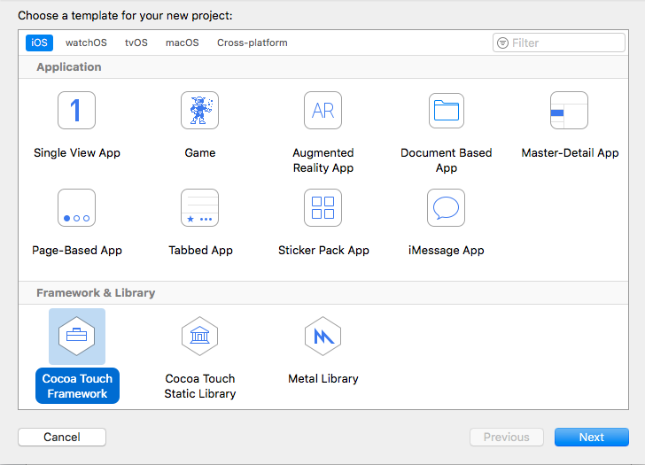
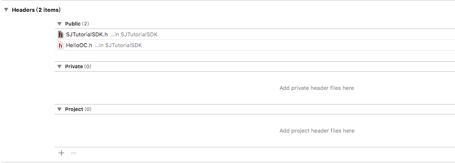
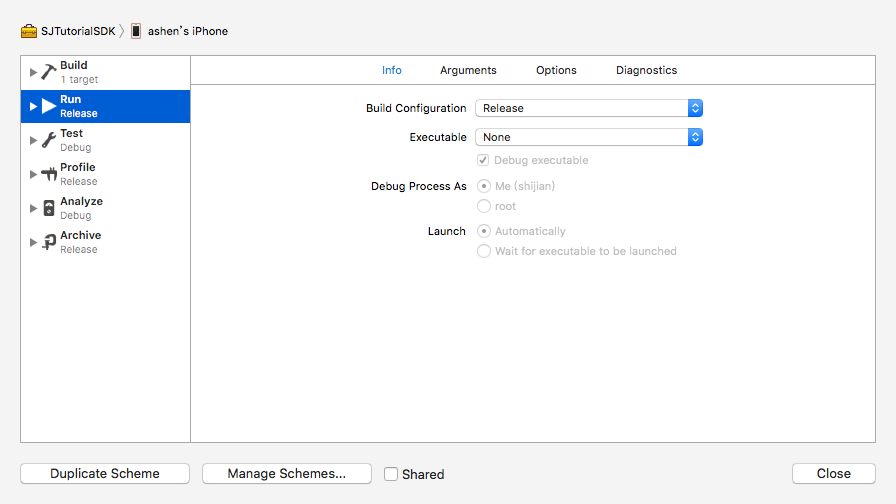

# 使用 pod 管理自己创建的 iOS 静态库

## 序言
本文将主要讨论如下几个问题:
- 1. OC 和 Swift 混编的形式创建支持多种架构的静态库（.framework）；
- 2. 静态库引用其他静态库（.framework 或 .a);
- 3. 静态库支持添加资源文件；
- 4. pod 管理静态库。

## 创建静态库 framework
最近由于和其他公司建立了各种合作关系，恼人的‘创建 SDK’工作被提上了日程，由于之前没有自己做过，在生成 framework 的时候踩了一些坑，后来在同事的帮助下总算是解决了，心中不免有些激动，在这里记录下来给用得上的码友们。
工作中难免会遇到这种情况，想把某个功能包装起来给其他人用，但是出于某种原因又不想公开自己的实现方式，这时就需要静态库（framework 或 .a）了。(PS：.a 和 .framework 的区别可以看下这篇文章: [iOS开发-.a与.framework区别？](https://www.jianshu.com/p/4a455425aae8))
### 如何创建静态库及引用其他静态库
```
XCode -> File -> New -> Project -> Cocoa Touch Framework
```

创建SJTutorialSDK，并新建测试类名为 HelloWorld（Swift）、HelloOC(OC)，目录如下：

```
├── SJTutorialSDK
│   ├── HelloOC.h                -> 暴露的 OC 类
│   ├── HelloOC.m
│   ├── HelloWorld.swift         -> 暴露的 Swift 类
│   ├── Info.plist
│   └── SJTutorialSDK.h          -> 当前静态库头文件
└── SJTutorialSDK.xcodeproj
    ├── project.pbxproj
    ├── project.xcworkspace
    │   ├── contents.xcworkspacedata
    │   └── xcuserdata
    │       └── shijian.xcuserdatad
    │           └── UserInterfaceState.xcuserstate
    └── xcuserdata
        └── shijian.xcuserdatad
            └── xcschemes
                └── xcschememanagement.plist
```

- 1. 对于 Swift，需要对外暴露的文件需要用 public（或 open）修饰，并且要继承自 NSObject(或其子类)；
- 2. 对于 OC，需要对外暴露的文件需要在“Build Phases -> Headers -> Public”添加相应头文件（例: HelloOC.h），并在 framework 的头文件（例: SJTutorialSDK.h）中添加该头文件的引用(例:#import \<SJTutorialSDK/HelloOC.h\>)
- 3. 如果当前 framework 引用了第三方 framework，需要在头文件（例: SJTutorialSDK.h）中添加对第三方头文件的引用（例: #import \<SJDemoSDK/Animals.h\>)

创建完成后的头文件如下：

```
//  SJTutorialSDK.h
//  SJTutorialSDK

#import <UIKit/UIKit.h>
FOUNDATION_EXPORT double SJTutorialSDKVersionNumber;
FOUNDATION_EXPORT const unsigned char SJTutorialSDKVersionString[];

// 第三方库的头文件
#import <SJDemoSDK/Animals.h>

// 对外暴露的头文件（仅限于 OC，Swift 添加 public 后会自动导入）
#import <SJTutorialSDK/HelloOC.h>
```
Build Phases 配置如下:

至此，静态库.framework 创建完毕。

### 支持多种架构
我们开发过程中经常提到的arm64，x86_64具体是什么东西呢？这里可以参考这篇文章: [iOS 中的 armv7,armv7s,arm64,i386,x86_64 都是什么](https://www.jianshu.com/p/3fce0bd6f045)。
简单点来说：模拟器 32/64 位处理器分别需要 i386/x86_64 架构，真机 32/64 位处理器分别需要 armv7(armv7s)/arm64。
所以，如果你构建的静态库只需要支持iPhone 5S 及以上(或iPad mini2 及以上)的真机和模拟器，那么你的静态库将只需要支持 arm64 和 x86_64。

- 1.调整到 Release(发布)模式：Edit Scheme -> Run -> Info -> Build Configuration -> Release；

- 2. 分别使用真机、模拟器编译，生成对应的 SJTutorialSDK.framework；
- 3. 合并 frameworks

```
# 查看静态库支持的架构
lipo -info xxx
# 合并 xxx1 和 xxx2，最后的文件支持两者支持的所有架构
lipo -create xxx1 xxx2 -output xxx1
lipo -creat Release-iphoneos/SJTutorialSDK.framework/SJTutorialSDK Release-iphonesimulator/SJTutorialSDK.framework/SJTutorialSDK -output Release-iphoneos/SJTutorialSDK.framework/SJTutorialSDK
```
生成 framework 时踩过的坑：output 的文件是 xxx，而不是 xxx.framework

- 4. 查看最后的静态库支持架构:

```
Architectures in the fat file: /Users/shijian/Desktop/SJTutorialSDK.framework/SJTutorialSDK are: x86_64 arm64
# congratulations
```
### 添加资源文件
在 iOS 中，可以通过 Bundle 文件管理资源文件(图片，语音，视频，plist，xib，storyboard等)，Bundle 文件实际上就是个普通的文件夹，只是在名字中添加了 .Bundle 的后缀而已。
对图片的命名最好添加上 @3x/@2x,这样系统会自动放在对应的位置，不需要我们额外的操作。
- 1. 新建文件夹 xxx，并添加相应资源，然后更名为 xxx.Bundle，也可以直接新建 xxx.Bundle, 鼠标右键 -> 显示包内容 -> 添加相应文件；

```
.
└── SJTutorialRes.Bundle
    ├── alipay@3x.png
    └── wechat@3x.png
```
- 2. 新建方法读取 Bundle 中的图片

```Swift
import UIKit

// public 以使外界能够访问
public class TutorialRes: NSObject {
    public static func getImg(_ name: String) -> UIImage? {
        guard let url = Bundle(for: TutorialRes.self).url(forResource: "SJTutorialRes", withExtension: "Bundle") else { return nil }
        guard let path = Bundle(url: url)?.path(forResource: name, ofType: nil) else { return nil }
        return UIImage(contentsOfFile: path)
    }
    
    public static func aliImg() -> UIImage? {
        return getImg("alipay@3x.png")
    }
    
    public static func WechatImg() -> UIImage? {
        return getImg("wechat@3x.png")
    }
    
}
```
至此，静态库已经创建完毕，当前创建的静态库 SJTutorialSDK, 支持: OC 和 Swift 混编，引用了其他第三方库，资源文件读取，多种架构。

## pod 管理静态库
如果自己的静态库是私有的，可以跳过 trunk 环节，直接在自己的代码仓库中创建好仓库，然后配置相应的 podspec 文件，pod 引用时指定对应的路径即可。但大多数情况下还是要给其他人使用的，我们当然也可以不通过 trunk，直接在引用时指定地址来使用当前仓库，但是这样用起来总是不那么直观。

```Shell
# 通过名称和指定地址使用
pod 'SJTutorialSDK',:git => "git@code.XXX/SJTutorialSDK.git"
# 通过名称
pod 'SJTutorialSDK'
```
两者对比起来，高下立判。所以建议还是通过 trunk 来 push 自己的代码。

### github 新建仓库及配置 podspec 文件
如何在 github 上新建仓库，网上已经有很多的教程，这里不再赘述，这里主要谈谈配置 podspec 文件。

podSpec 官方解释: [A Podspec, or Spec, describes a version of a Pod library.](http://guides.cocoapods.org/making/specs-and-specs-repo.html) ,其实就是一个描述 pod 库的信息(版本，依赖，作者，描述，系统库等)的文件。

- 1.配置 SJTutorialSDK.podspec

``` Shell
Pod::Spec.new do |s|

  s.name         = "podSDK"
  s.version      = "0.0.1"
  s.summary      = "当前库的总结。"

  s.description  = <<-DESC
描述文件
                   DESC

  s.homepage     = "http://EXAMPLE/podSDK"
  s.license      = "MIT"
  s.author             = { "shmily" => "shmilyshijian@foxmail.com" }
  s.platform     = :ios, "9.0"
  s.source       = { :git => "https://github.com/515783034/podSDK.git", :tag => "#{s.version}" }

  s.resources = "podSDK/Resources/*.*"

  # 本库提供的framework静态库
  s.vendored_frameworks = 'podSDK/Sources/*.framework'


  #################

  # 依赖的系统动态库
  # s.frameworks = "SomeFramework", "AnotherFramework"
  # 依赖的系统静态库
  # s.libraries = "iconv", "z"

  # 本库提供的a静态库
  #s.vendored_libraries  = 'podSDK/Sources/*.a'

  # 本库添加的第三方依赖库
  #s.dependency "SJLineRefresh", "~> 1.4"

end
```
关于 podspec 的内容，可以查看之前写过的文章: [创建公共/私有pod --podspec](https://www.jianshu.com/p/1139a603f413), 这里也不再过多赘述。
由于当前仓库只是引用了几个静态库，所以 sources 可以不配置，只需要配置 vendored_frameworks 即可。

- 2.验证配置是否合理

```Shell
pod lib lint
# 如果验证中有警告，可以添加参数 --allow-warnings 可以忽略
```

- 3. trunk push

```Shell
pod trunk push SJTutorialSDK.podspec
```

- 4. 版本控制(tag)

```Shell
git tag -m "desc" 1.0.0
git push --tag
# podspec 中修改对应的 s.version
```

上传成功，enjoy

```
 🎉  Congrats

 🚀  podSDK (0.0.1) successfully published
 📅  March 19th, 05:04
 🌎  https://cocoapods.org/pods/podSDK
 👍  Tell your friends!
```

